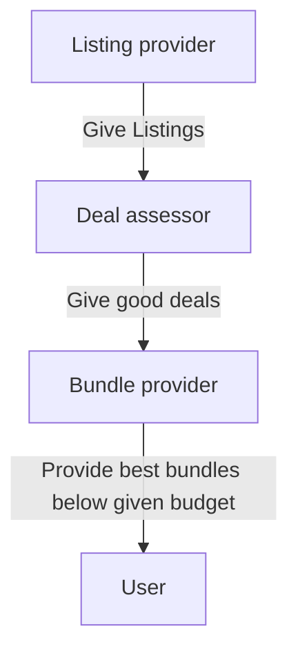

# Analysis
## Environmental model
- product listing
- physical game
- game key
- console
- product price
- shipping price
- console variant
- store
## Preliminary roles
 ```mermaid
    graph TD;
    A[Listing provider];
    B[Price assessor];
    C[Store provider];
    D[Price trend keeper];
    A -->|Give listings| B;
    B -->|Collect listings| A;
    C -->|Give stores to search from| A;
    A -->|Request stores| C;
    D -->|Give historical price data for a product| B;
    A -->|Provide new price data| D;
```
preliminary roles for finding game for cheap locally


preliminary roles for finding best deals for a budget

## Role model
### Role schema
Listing provider
### Description
This role is responsible for scanning the stores and giving product listings.
### Protocols and activities
__ScanStores__, ProvideListings, SendStores
### Permissions
- **Generates** Listings
- **Reads** Stores
